# 2nd Infodengue-Mosqlimate Dengue Challenge (IMDC): 2025 Sprint for dengue fever forecasts for Brazil
## Ensemble Models Results

**Organization:**  

**Funding:**  

This file presents the results of ensembling the contributed forecasting models during the 2025 sprint.  

---

## Teams and models

In this 2nd edition, 15 teams contributed with 19 dengue forecast models for all Brazilian states for the years 2025 and 2026.

| Team/Model / Leader | Model name | Model ID | Approach | Spatial scale | Variables/datasets | Climate data |
|----------------------|-----------|----------|----------|---------------|--------------------|--------------|
| [Preditores_da_Picada](https://github.com/rick0110/Preditores_da_Picada) — Richard Elias Soares Viana (IMPA-Tech) |IMPA - TECH |[108](https://api.mosqlimate.org/registry/model/108/) | SARIMAX (Seasonal AutoRegressive Integrated Moving Average with eXogenous variables) time series modeling | Municipality, State | Dengue cases, Temperature and humidity, Vector indices | Yes |
| [LaCiD/UFRN](https://github.com/lacidufrn/infodengue_sprint_2025) — Marcus Nunes ([LaCiD/UFRN](https://github.com/lacidufrn/infodengue_sprint_2025)) | LaCiD/UFRN |[131*](https://api.mosqlimate.org/registry/model/131/) | ARIMAX (AutoRegressive Integrated Moving Average with eXogenous) | State | Temperature, Dengue cases | Yes |
| [JBD – Mosqlimate](https://github.com/davibarreira/jbd-mosqlimate-sprint) — Davi Sales Barreira (FGV/EMAp) | Chronos-Bolt | [133](https://api.mosqlimate.org/registry/model/133/) | Chronos (probabilistic time-series forecasting model from Amazon) | State | Dengue cases, Climate indices ENSO | Yes |
| [ISI Foundation](https://github.com/DavideNicola/ISI_Dengue_Model?tab=readme-ov-file) — Davide Nicola (ISI) | ISI_Dengue_Model| [134](https://api.mosqlimate.org/registry/model/134/) | A vector–host SEIR ODE system for humans and mosquitoes | State | Dengue cases, Weather data, Vector parameters | Yes |
| [The Global Health Resilience (GHR)](https://github.com/chlobular/ghr-imdc-2025) — Rachel Lowe (BSC) | GHR Model|[135](https://api.mosqlimate.org/registry/model/135/) | Bayesian hierarchical mixed-effects model | State, Health region | Dengue cases, Temperature, Precipitation, Surface temperature anomaly (ONI), Köppen, Biome | Yes |
| [Imperial College London](https://github.com/hadrianang/imperial-mosqlimate-sprint2025) — Hadrian Ang ([Imperial College London](https://github.com/hadrianang/imperial-mosqlimate-sprint2025)) | Imperial-TFT Model |[136](https://api.mosqlimate.org/registry/model/136/) | Temporal Fusion Transformer (TFT), deep-learning + Random Forest for climate variables | State | Dengue cases, Temperature, Precipitation, Pressure, Relative humidity, Koppen climate classification, Brazilian biomes | Yes |
| [CERI Forecasting Club](https://github.com/graeme-dor/dengue-sprint-2025) — Graeme Dor (CERI Stellenbosch University) | LSTM-RF model|[137*](https://api.mosqlimate.org/registry/model/137/) | Ensemble: RF and LSTM per state, lowest RMSE chosen | State | Dengue cases, Temperature, Precipitation, Relative humidity | Yes |
| [TSMixer ZKI-PH4](https://github.com/DiogoParreira/ZKI-PH) — Diogo Parreira (Robert Koch Institute) | TSMixer ZKI-PH4|[138](https://api.mosqlimate.org/registry/model/138/) | Time Series Mixer (TSMixer) | Municipality, State | Dengue cases, Climate | Yes |
| [DengueSprint_Cornell-PEH](https://github.com/anabento/DengueSprint_Cornell-PEH) — Ana Bento (Cornell University) | Cornell PEH| [158**](https://api.mosqlimate.org/registry/model/158/) | Negative Binomial Baseline Model | State | Dengue cases | No |
| [GeoHealth Dengue Forecasting Team](https://github.com/ChenXiang1998/2025-Infodengue-Sprint) — Paula Moraga (KAUST) | Kaust GeoHealth| [141*](https://api.mosqlimate.org/registry/model/141/) | LSTM with climate covariates | State | Dengue cases, Temperature, Precipitation, Humidity, Pressure, Environmental data | Yes |
| [Strange Attractors Contributor](https://github.com/marciomacielbastos/MosqlimateSprint2025) — Marcio Maciel Bastos (FGV/EMAp) |Model fourier-gravidade| [143](https://api.mosqlimate.org/registry/model/143/) | Bayesian state-level forecasting (Gravity Component + Bayesian Inference) | State | Dengue cases | No |
| [Beat it](https://github.com/lsbastos/sprint2025) — Leonardo Bastos (FIOCRUZ) | Beat it|[144](https://api.mosqlimate.org/registry/model/144/) | Baseline Bayesian model — negative binomial with Gaussian random effects | State, Region | Dengue cases | No |
| [DS_OKSTATE](https://github.com/haridas-das/DS_OKSTATE_2025) — Lucas Storleman (Oklahoma State University) | CNNLSTM|[145](https://api.mosqlimate.org/registry/model/145/) | CNN–LSTM hybrid | Municipality, State | Dengue cases, Temperature, Precipitation, Humidity, Pressure, Environmental data | Yes |
| [D-FENSE/LNCC-AR_p-2025-1](https://github.com/americocunhajr/D-FENSE) — Americo Cunha Jr (LNCC / UERJ) | LNCC-AR_p-1|[150](https://api.mosqlimate.org/registry/model/150/) | AR(p) autoregressive process | State | Dengue cases, epiweek | No |
| [D-FENSE/UERJ-SARIMAX-2025-2](https://github.com/americocunhajr/D-FENSE) — Americo Cunha Jr (LNCC / UERJ) |UERJ-SARIMAX-2| [157](https://api.mosqlimate.org/registry/model/157/) | SARIMAX with exogenous inputs | State | Dengue cases, weekly temperature median, 52-week rolling mean of precipitation median  | Yes |
| [D-FENSE/LNCC-CliDENGO-2025-1](https://github.com/americocunhajr/D-FENSE) — Americo Cunha Jr (LNCC / UERJ) | LNCC-CLIDENGO-1|[152](https://api.mosqlimate.org/registry/model/152/) | CLiDENGO (climate-modulated beta-logistic growth model) | State | Dengue cases, temperature (min/mean/max), precipitation (min/mean/max), and relative humidity (min/mean/max) | Yes |
| [D-FENSE/LNCC-SURGE-2025-1](https://github.com/americocunhajr/D-FENSE) — Americo Cunha Jr (LNCC / UERJ) |LNCC-SURGE-1 |[154](https://api.mosqlimate.org/registry/model/154/) | SURGE (average surge model) | State | Dengue cases, epiweek | No |
| [Dengue oracle M1](https://github.com/eduardocorrearaujo/dengue-oracle) — Eduardo Araujo (FGV-EMAP) |Dengue Oracle M1| [155](https://api.mosqlimate.org/registry/model/155/) | Baseline LSTM with cases, epiweek, population | Municipality, State, Health region | Dengue cases, epiweek, population | No |
| [Dengue oracle M2](https://github.com/eduardocorrearaujo/dengue-oracle) — Eduardo Araujo (FGV/EMAp) | Dengue Oracle M1| [156](https://api.mosqlimate.org/registry/model/156/) | Baseline LSTM with covariates | Municipality, State, Health region | Dengue cases, epiweek, enso value, population, biome predominant | Yes |

\* Models 131 and 141 were not included in the validation results due to methodological or reproducibility issues. Model 137 was excluded from the ensemble due to inconsistencies observed in its forecasts for 2026.

\** Initially, this model was associated with ID 139. However, during the 2026 forecast submission, an error in the modeling process was identified. A corrected model was then submitted, with all validation results and forecasts reassigned to model ID 158.

---

## The Ensemble

### Score Normalization

Instead of using the mean WIS in each validation test, as done in the previous sprint step, we propose a normalized WIS score that accounts for the total number of cases in the period, as defined by the equation below:

$$
\text{WIS}^{\text{norm}} = \frac{\sum_{t=1}^{T} \text{WIS}_t}{Y_\text{total}},
$$

where:
- $\text{WIS}_t$: Weighted Interval Score for week *t*  
- $Y_\text{total}$: Total number of cases in the period  
- $T$: Total number of weeks in the validation period  
---

### Forecast Puzzle

The figure below shows, for each row, the rank of the model corresponding to the column name within each validation set, based on the normalized WIS ($\text{WIS}^{\text{norm}}$). For each state, the model with the lowest average $\text{WIS}^{\text{norm}}$ across the three validation periods was selected (column name). The figure illustrates that model performance can vary between validation years, as observed for states such as RJ and BA. This lack of consistency in model performance, combined with the limited number of validation samples, informed the methodology used for constructing the ensemble.

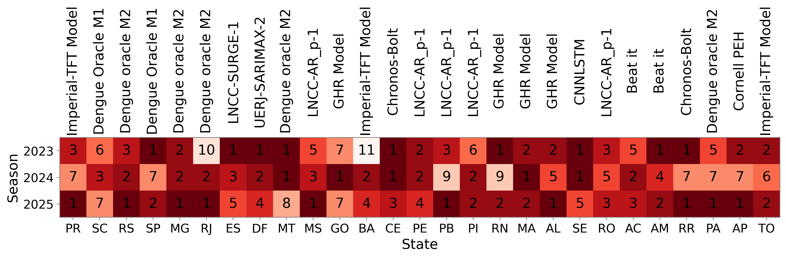  
*Ranking position of the best model throughout the entire period in each validation season (based on $\text{WIS}^{\text{norm}}$).*

---

### Ensemble Method

Following the [COVID Hub methodology](https://doi.org/10.1016/j.ijforecast.2022.06.005) we computed the median of predictive intervals from each model. Since the results were similar to those obtained from logarithmic pooling with equal weights, we opted for the **median**, which does not need a parametric approximation.
 We compared the performance of using the median across all models in all validation steps and also evaluated an ensemble constructed from the **top 5 models** identified in the first two validation sets. This ensemble was then compared to individual models (2025) in terms of relative Skill Scores.

---

### Skill Score Definition

To assess the performance of the ensemble relative to individual models:

$$
SS_{m, v} = 1 - \frac{WIS^{\text{norm}}_{\text{Ensemble}, v}}{WIS^{\text{norm}}_{m, v}}
$$

where:
- $m$ is an individual model  
- $v$ is a validation test  

**Positive values indicate that the ensemble model outperforms the individual model.**

---

## Results

### Ensemble (All Models) vs Individual Models

In the figure below, each panel corresponds to a validation set, and each point represents the Skill Score (SS) of the ensemble—computed as the median across all models—compared to individual models in terms of $\text{WIS}^{\text{norm}}$. Orange dots indicate positive SS values, while blue dots indicate negative values. Models with SS below –1 are highlighted using distinct colors and markers, with their names, along with the corresponding states, emphasized in the legend.

Overall, there are cases where the ensemble outperforms all individual models, such as RR, AP, ES, and RN in 2023; PR, RS, SP, and DF in 2024; and DF, CE, SE, and RO in 2025. There are also situations where the ensemble outperforms approximately half of the models, for example MG, SP, DF, GO, and MT in 2023; MT, MS, AL, PE, and PI in 2024; and GO, PI, and PA in 2025.
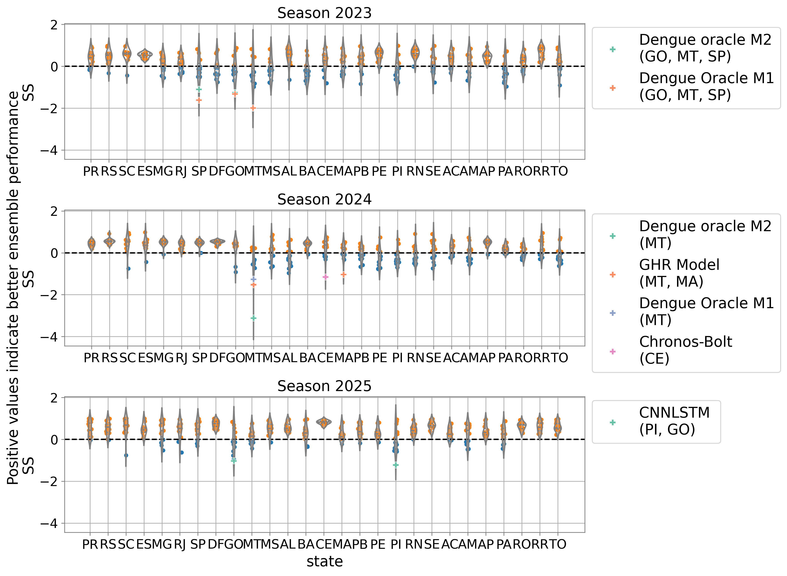

---

### Ensemble (Top 5) vs Best Model  

To assess the performance of ensembles with fewer members, the figure below presents the SS of an ensemble composed of the top 5 best-performing models from validation tests 1 and 2, compared against the best individual model from those same tests. Both the ensemble and individual models are evaluated using predictions and scores from validation test 3. Overall, the median SS is 0.12. However, in some cases, the ensemble performs substantially worse than the individual model (e.g., RJ). 

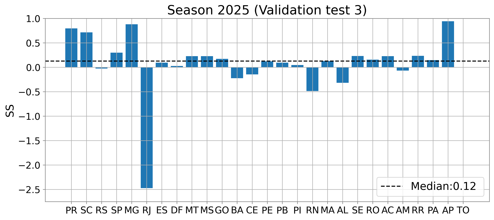

---

### Ensemble (Top 5) vs Individual Models

The figure below shows the Skill Scores (SS) of an ensemble composed of the top 5 best-performing models from validation tests 1 and 2, compared to each individual model. Both the ensemble and individual models are evaluated using predictions and scores from validation test 3. Orange dots indicate positive SS values, while models with SS below 0 are highlighted using distinct colors and markers, with their names and corresponding states emphasized in the legend. In all states, the ensemble outperforms the majority—or in some cases all—of the individual models.

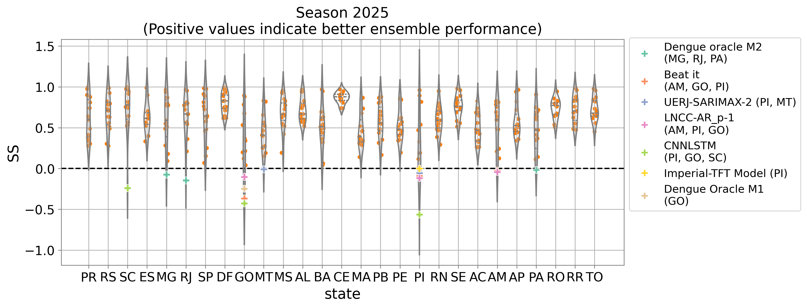

Given that the methodology using the top 5 models is evaluated over a single year, we propose two scenarios for the final results:

1. Median of the top 5 models, ranked according to the average $\text{WIS}^{\text{norm}}$ across the three periods;

2. Best model, ranked according to the average $\text{WIS}^{\text{norm}}$ across the three periods.

---

### Regional Results

The panels below show results for each state, grouped by macroregion. In each section, the first panel represents the weekly incidence, and the second panel shows the cumulative incidence. Within the panels, the median ensemble predictions are displayed as dashed blue lines, the median predictions of the best model for each state as solid red lines, predictions from the other models as solid grey lines, and the incidence from the previous season as dotted black lines. The cumulative incidence was computed by summing the median predictions; therefore, it does not include prediction intervals.

#### South Region
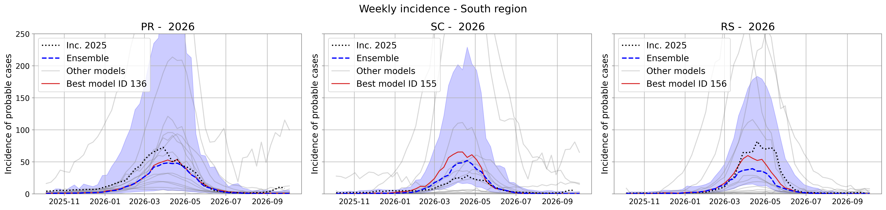  
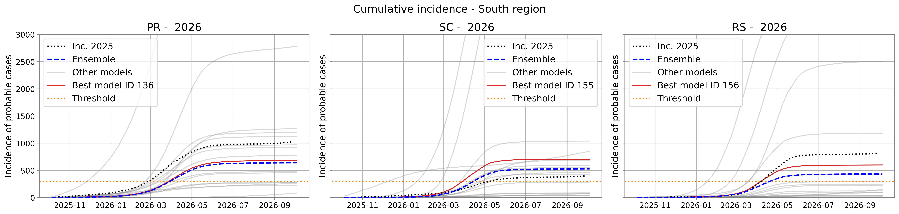

#### Southeast Region
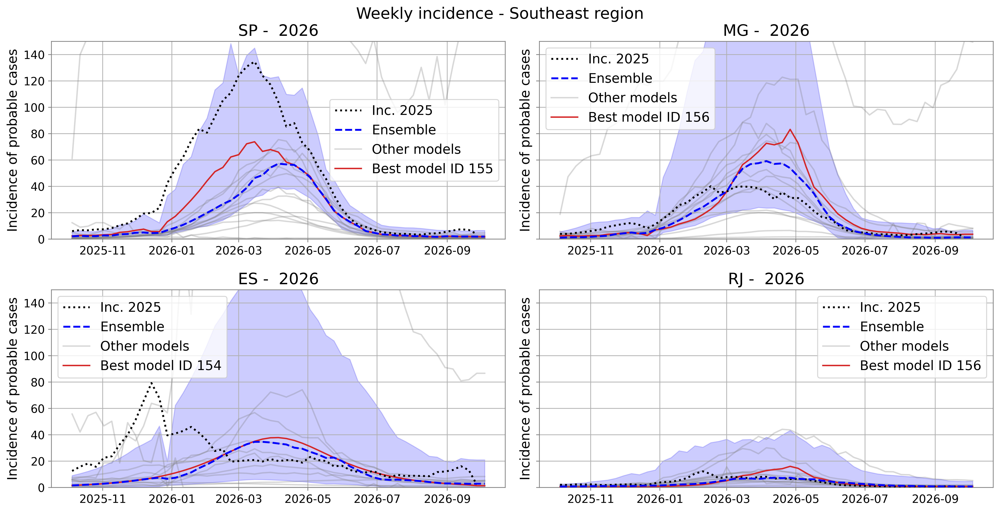  
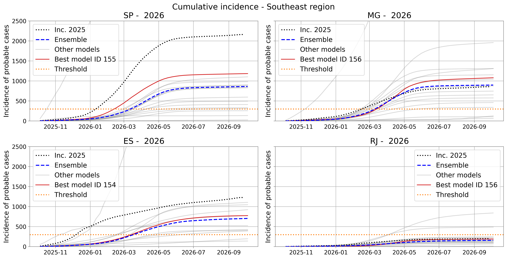

#### Midwest Region
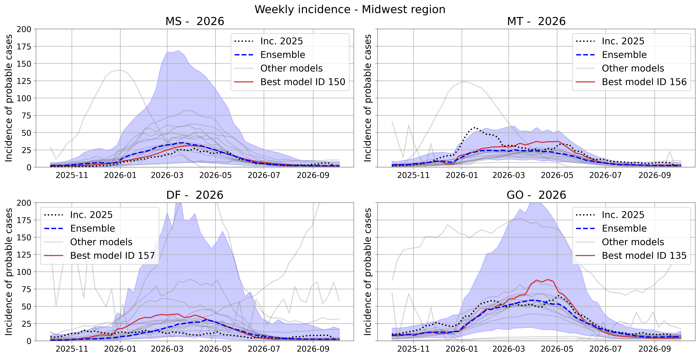  
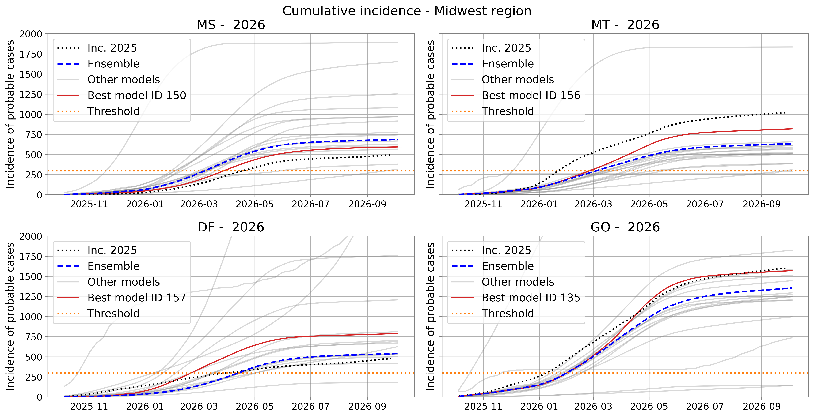

#### Northeast Region
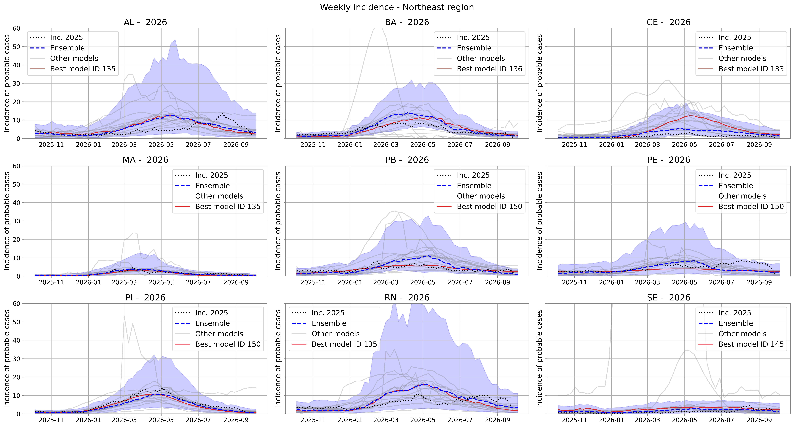  
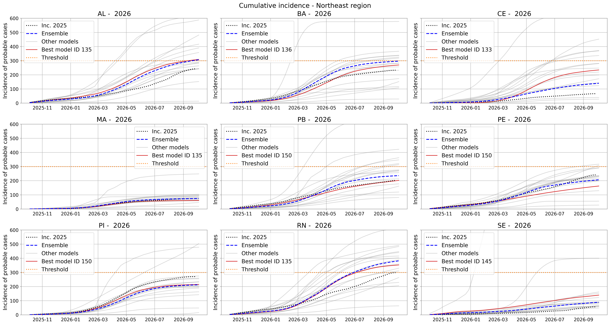

#### North Region
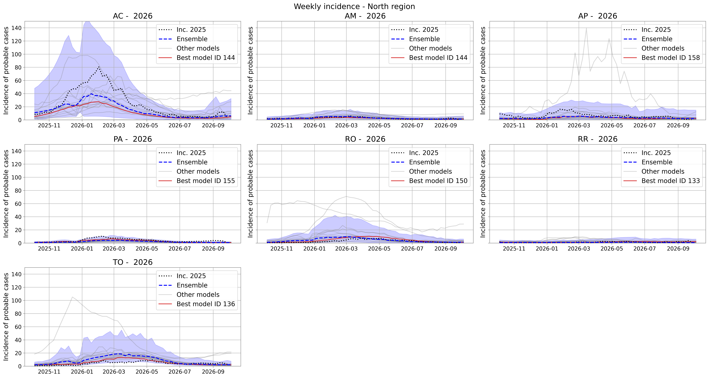  
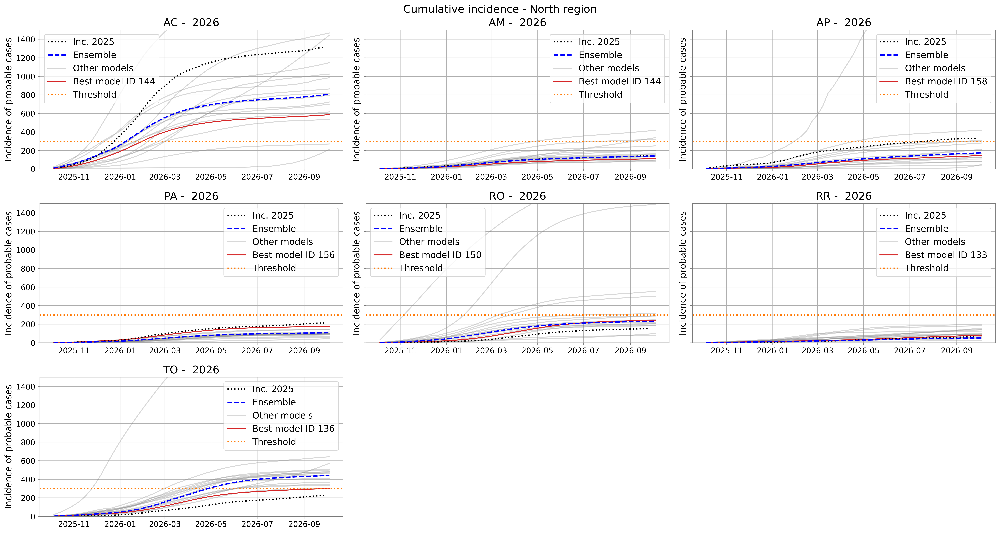

#### Brazil (National)

To compute the total number of cases for the season based on the ensemble and best model predictions, we applied the following steps:  

1. **Weekly approximation**: For each predicted week in the season, we approximated the distribution as log-normal by fitting the submitted prediction intervals to the CDF of a log-normal distribution through an optimization procedure. To compute the parameters, we used the following procedure. Let $L$ denote the number of symmetric prediction intervals available for a given model, and assume that the median $m$ is always provided. In this case, one obtains $J = 2L + 1$ quantiles from the predictive distribution, resulting in a sequence of quantiles $q_j$ with associated probability levels $\gamma_j$.

To estimate the parameters $\theta$ of a log-normal distribution that best fit this sequence of quantiles, we solve the following optimization problem:

$$
\theta = arg \ min_{\theta \in \boldsymbol{\Theta}} \sum_{j=1}^{J} \frac{|q_j - Q_\theta(\gamma_j)|}{|q_j|},
$$

where $Q_\theta(\gamma_j)$ denotes the $\gamma_j$-quantile of the log-normal distribution with parameters $\theta$.

Quantiles equal to zero are excluded from the optimization when they correspond to percentiles below the median (50th percentile). If the median itself is zero, we fix $\mu = 0.01$ and $\sigma = 0.5$ as as the parameters of the distribution.

2. **Sampling method.** In order to sample paths from probabilistic forecasts, we use Gaussian Copulas to generate time-dependent paths.
The dependence structure is imposed via the autocorrelation parameter $\rho$ estimated from the historical series.
The process transforms the sampled values into uniform quantiles and then into correlated Gaussian variables,
generating new values through a linear relationship $Z_{t+1} = \rho Z_t + \sqrt{1-\rho^2}\varepsilon_t$. The values are then
mapped back to the original marginals, producing sample paths that preserve the predicted distributions
and that have a temporal dependence structure similar to the historical data. 

The figure below shows the cumulative incidence from the last season (2025), along with the 90% prediction intervals for the ensemble (blue) and individual model (red) predictions for 2026. 

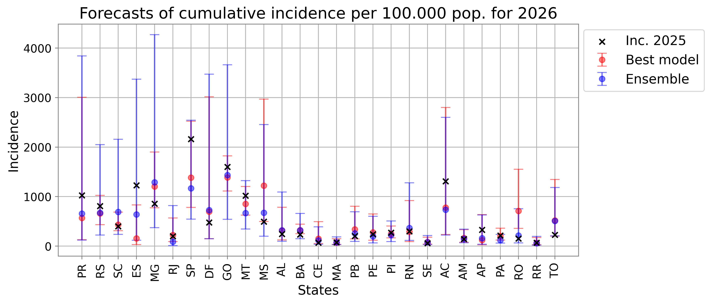

The map and table below show, by state, the percentage ratio between the cumulative incidence predicted by the median of the ensemble model and the cumulative incidence observed during the 2025 season.

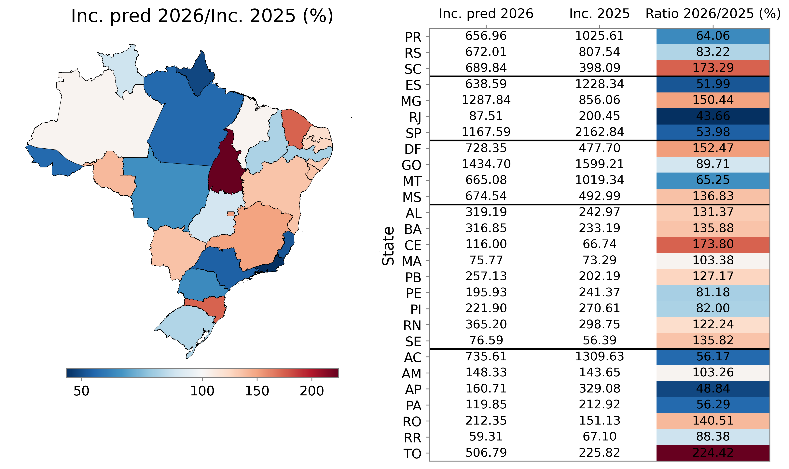

---

### Access to data

The figure presenting the ranking of the models was produced with the notebook `compute_the_scores_norm.ipynb`. The weekly ensemble forecasts are available in the file `predictions/ensemble_median_2026.csv.gz`, and the corresponding cumulative values can be found in `ensemble_median_2026_cum_cases.csv.gz`.
The notebook used to generate these files is `ensemble_2026.ipynb`, while the figures presented in the forecast report were produced using `plot_ensemble_reports.ipynb`.
Forecasts produced by each individual model can be accessed through the Mosqlimate API—please refer to our documentation for further details. They are saved at the file `predictions/forecasts_2nd_sprint_update.csv.gz`. 

### Important Dates

> **Save these dates!**
> 1. Webinar presenting results for the Brazilian Ministry of Health — **October 31, 2025**

