# 2nd Infodengue-Mosqlimate Dengue Challenge (IMDC): 2025 Sprint for dengue fever forecasts for Brazil

The Infodengue-Mosqlimate Dengue Challenge (IMDC) is an initiative led by the Mosqlimate and Infodengue in collaboration with the Harmonize and IDExtremes projects.

The objective of this 2025 sprint is **to promote training of predictive models and to develop high-quality ensemble forecast models for dengue in Brazil.**

The challenge involves three validation tests and one forecast target. The period of interest spans from the epidemiological week (EW) 41 of one year to EW 40 of the following year, aligning with the typical dengue season in Brazil.

**Validation test 1.** Predict the weekly number of dengue cases by state (UF) in the 2022-2023 season \[EW 41 2022- EW40 2023\], using data covering the period from EW 01 2010 to EW 25 2022;

**Validation test 2.** Predict the weekly number of dengue cases by state (UF) in the 2023-2024 season \[EW 41 2023- EW40 2024\], using data covering the period from EW 01 2010 to EW 25 2023;

**Validation test 3:** Predict the weekly number of dengue cases by state (UF) in the 2024-2025 season \[EW 41 2024- EW40 2025\], using data covering the period from EW 01 2010 to EW 25 2024;

**Forecast.** Predict the weekly number of dengue cases in Brazil, and by state (UF), in the 2025-2026 season \[EW 41 2025- EW40 2026\], using data covering the period from EW 01 2010 to EW 25 2025;

## Teams and models

In this 2nd edition, 15 teams contributed with 19 dengue forecast models for all Brazilian states for the years 2025 and 2026.

| Team/Model / Leader | Model ID | Approach | Spatial scale | Variables/datasets | Climate data |
|----------------------|----------|----------|---------------|--------------------|--------------|
| [Preditores_da_Picada](https://github.com/rick0110/Preditores_da_Picada) — Richard Elias Soares Viana (IMPA-Tech) | [108](https://api.mosqlimate.org/registry/model/108/) | SARIMAX (Seasonal AutoRegressive Integrated Moving Average with eXogenous variables) time series modeling | Municipality, State | Dengue cases, Temperature and humidity, Vector indices | Yes |
| [LaCiD/UFRN](https://github.com/lacidufrn/infodengue_sprint_2025) — Marcus Nunes ([LaCiD/UFRN](https://github.com/lacidufrn/infodengue_sprint_2025)) | [131*](https://api.mosqlimate.org/registry/model/131/) | ARIMAX (AutoRegressive Integrated Moving Average with eXogenous) | State | Temperature, Dengue cases | Yes |
| [JBD – Mosqlimate](https://github.com/davibarreira/jbd-mosqlimate-sprint) — Davi Sales Barreira (FGV/EMAp) | [133](https://api.mosqlimate.org/registry/model/133/) | Chronos (probabilistic time-series forecasting model from Amazon) | State | Dengue cases, Climate indices ENSO | Yes |
| [ISI Foundation](https://github.com/DavideNicola/ISI_Dengue_Model?tab=readme-ov-file) — Davide Nicola (ISI) | [134](https://api.mosqlimate.org/registry/model/134/) | A vector–host SEIR ODE system for humans and mosquitoes | State | Dengue cases, Weather data, Vector parameters | Yes |
| [The Global Health Resilience (GHR)](https://github.com/chlobular/ghr-imdc-2025) — Rachel Lowe (BSC) | [135](https://api.mosqlimate.org/registry/model/135/) | Bayesian hierarchical mixed-effects model | State, Health region | Dengue cases, Temperature, Precipitation, Surface temperature anomaly (ONI), Köppen, Biome | Yes |
| [Imperial College London](https://github.com/hadrianang/imperial-mosqlimate-sprint2025) — Hadrian Ang ([Imperial College London](https://github.com/hadrianang/imperial-mosqlimate-sprint2025)) | [136](https://api.mosqlimate.org/registry/model/136/) | Temporal Fusion Transformer (TFT), deep-learning + Random Forest for climate variables | State | Dengue cases, Temperature, Precipitation, Pressure, Relative humidity, Koppen climate classification, Brazilian biomes | Yes |
| [CERI Forecasting Club](https://github.com/graeme-dor/dengue-sprint-2025) — Graeme Dor (CERI Stellenbosch University) | [137](https://api.mosqlimate.org/registry/model/137/) | Ensemble: RF and LSTM per state, lowest RMSE chosen | State | Dengue cases, Temperature, Precipitation, Relative humidity | Yes |
| [TSMixer ZKI-PH4](https://github.com/DiogoParreira/ZKI-PH) — Diogo Parreira (Robert Koch Institute) | [138](https://api.mosqlimate.org/registry/model/138/) | Time Series Mixer (TSMixer) | Municipality, State | Dengue cases, Climate | Yes |
| [DengueSprint_Cornell-PEH](https://github.com/anabento/DengueSprint_Cornell-PEH) — Ana Bento (Cornell University) | [139](https://api.mosqlimate.org/registry/model/139/) | Negative Binomial Baseline Model | State | Dengue cases | No |
| [GeoHealth Dengue Forecasting Team](https://github.com/ChenXiang1998/2025-Infodengue-Sprint) — Paula Moraga (KAUST) | [141*](https://api.mosqlimate.org/registry/model/141/) | LSTM with climate covariates | State | Dengue cases, Temperature, Precipitation, Humidity, Pressure, Environmental data | Yes |
| [Strange Attractors Contributor](https://github.com/marciomacielbastos/MosqlimateSprint2025) — Marcio Maciel Bastos (FGV/EMAp) | [143](https://api.mosqlimate.org/registry/model/143/) | Bayesian state-level forecasting (Gravity Component + Bayesian Inference) | State | Dengue cases | No |
| [Beat it](https://github.com/lsbastos/sprint2025) — Leonardo Bastos (FIOCRUZ) | [144](https://api.mosqlimate.org/registry/model/144/) | Baseline Bayesian model — negative binomial with Gaussian random effects | State, Region | Dengue cases | No |
| [DS_OKSTATE](https://github.com/haridas-das/DS_OKSTATE_2025) — Lucas Storleman (Oklahoma State University) | [145](https://api.mosqlimate.org/registry/model/145/) | CNN–LSTM hybrid | Municipality, State | Dengue cases, Temperature, Precipitation, Humidity, Pressure, Environmental data | Yes |
| [D-FENSE/LNCC-AR_p-2025-1](https://github.com/americocunhajr/D-FENSE) — Americo Cunha Jr (LNCC / UERJ) | [150](https://api.mosqlimate.org/registry/model/150/) | AR(p) autoregressive process | State | Dengue cases, epiweek | No |
| [D-FENSE/UERJ-SARIMAX-2025-1](https://github.com/americocunhajr/D-FENSE) — Americo Cunha Jr (LNCC / UERJ) | [157](https://api.mosqlimate.org/registry/model/157/) | SARIMAX with exogenous inputs | State | Dengue cases, Temperature, Precipitation, Humidity, Pressure, Environmental data | Yes |
| [D-FENSE/LNCC-CliDENGO-2025-1](https://github.com/americocunhajr/D-FENSE) — Americo Cunha Jr (LNCC / UERJ) | [152](https://api.mosqlimate.org/registry/model/152/) | CLiDENGO (climate-modulated beta-logistic growth model) | State | Dengue cases, Temperature, Precipitation, Humidity, Pressure, Environmental data | Yes |
| [D-FENSE/LNCC-SURGE-2025-1](https://github.com/americocunhajr/D-FENSE) — Americo Cunha Jr (LNCC / UERJ) | [154](https://api.mosqlimate.org/registry/model/154/) | SURGE (average surge model) | State | Dengue cases, Temperature, Precipitation, Humidity, Pressure, Environmental data | Yes |
| [Dengue oracle M1](https://github.com/eduardocorrearaujo/dengue-oracle) — Eduardo Araújo (FGV-EMAP) | [155](https://api.mosqlimate.org/registry/model/155/) | Baseline LSTM with cases, epiweek, population | Municipality, State, Health region | Dengue cases, epiweek, population | No |
| [Dengue oracle M2](https://github.com/eduardocorrearaujo/dengue-oracle) — Eduardo Araújo (FGV/EMAp) | [156](https://api.mosqlimate.org/registry/model/156/) | Baseline LSTM with covariates | Municipality, State, Health region | Dengue cases, epiweek, enso value, population, biome predominant | Yes |

\* Models 131 and 141 were not included in the validation results due to methodological or reproducibility issues

# Scoring and Ranking

The code used to generate the results below is available in the following notebooks:

* **`val_preds.ipynb`**: Validates whether the submitted predictions meet all the requirements.  
* **`load_the_predictions.ipynb`**: Loads the predictions submitted by all models and saves them into a CSV file.  
* **`log_normal_parameters.ipynb`**: Parametrizes each prediction for each date as a log-normal distribution.  
* **`compute_the_total_cases.ipynb`**: Computes the total predicted cases for each season.  
* **`compute_the_scores.ipynb`**: Calculates the WIS score for each model across all states and validation tests.  
* **`plot_scores.ipynb`**: Generates heatmap tables with WIS scores for each Brazilian region and highlights the best-performing models for both states and regions.  
* **`plot_series.ipynb`**: Plots the predicted time series for each model across states and validation tests.  

## Scores

Model performance was evaluated using the Weighted Interval Score (WIS), computed with the [mosqlient](https://github.com/Mosqlimate-project/mosqlimate-client/tree/main) Python package.
The WIS is a proper scoring rule for probabilistic forecasts
that balances sharpness and calibration. It summarizes forecast quality by doing a weighted average of the Interval Score (IS) and the absolute error of the median.

The Interval Score for a central prediction interval with miscoverage rate $\alpha_k$ (i.e., coverage $1-\alpha_k$) is:
$$
\text{IS}_{\alpha_k}(F, y) = (u_k - l_k) + \frac{2}{\alpha_k}(l_k - y) I\{y < l_k\} + \frac{2}{\alpha_k}(y - u_k) I\{y > u_k\},
$$
where
- $F$ is the forecast cumulative distribution function (CDF)
- $y$ is the observed value
- $\alpha_k$ is the miscoverage rate of $F$ for the $k$-th interval
- $l_k$, $u_k$ are the $1 - \alpha_k/2$ and $1 + \alpha_k/2$ quantiles of $F$, respectively
- $I\{\cdot\}$ is the indicator function

The WIS is then computed as:

$$
\text{WIS}_{\alpha_{\{0:K\}}}(F, y) = \frac{1}{K + 1/2} \left( w_0 |y - m| + \sum_{k=1}^K w_k \text{IS}_{\alpha_k}(F, y) \right),
$$

where
- $m$ is the predicted median
- $K$ is the number of prediction intervals
- $w_0$ is the weight for the median, which is set to 1/2 by default
- $w_k$ is the weight for the $k$-th interval, which is set to $\alpha_k/2$ by default

Each model in this challenge was evaluated by computing the average WIS for each state and validation test. We assessed model performance in two ways:

1. **Full validation test:** Average WIS over the full period of each validation test (1, 2, and 3).
2. **Around the seasonal peak:** Average WIS within a three-week window centered on the peak week of dengue cases.

The evaluation produced six distinct WIS scores for each model ($\text{Model}_i$) in each state ($\text{State}_j$), summarized in the table below:

**Table: $\text{Model}_i$ x $\text{State}_j$ — WIS Scores**

| Score   | Formula                                                                 | Validation Test Range                                 |
|---------|-------------------------------------------------------------------------|-----------------------------------------------------|
| $S_1$   | Average WIS over the full period of Validation Test 1 | EW41 2022 - EW40 2023                               |
| $S_2$   | Average WIS over the full period of Validation Test 2 | EW41 2023 - EW40 2024                               |
| $S_3$   | Average WIS over the full period of Validation Test 3 | EW41 2024 - EW25 2025                               |
| $S_4$   | Average WIS over three-week window centered on the peak | EW41 2022 - EW40 2023                               |
| $S_5$   | Average WIS over three-week window centered on the peak | EW41 2023 - EW40 2024                               |
| $S_6$   | Average WIS over three-week window centered on the peak | EW41 2024 - EW25 2025                               |

## Ranking

### Best-performing models per state

For each state, we ranked the models by first computing separate rankings for each of the six WIS scores ($S_1$ to $S_6$). Each model received a rank $R_{m,i,\text{state}}$ for score $i$ in that state.

The final rank for each model in each state was then computed using the formula:

$$R_{m,\text{state}} = \sum_{i=1}^{6} \frac{1}{R_{m,i,\text{state}}}$$

where:
- $m$ indexes the model
- $i$ indexes the score ($S_1$ to $S_6$)
- $\text{state}$ refers to the specific state being evaluated

The bar plot below shows the number of states that each model achieved the best rank in.

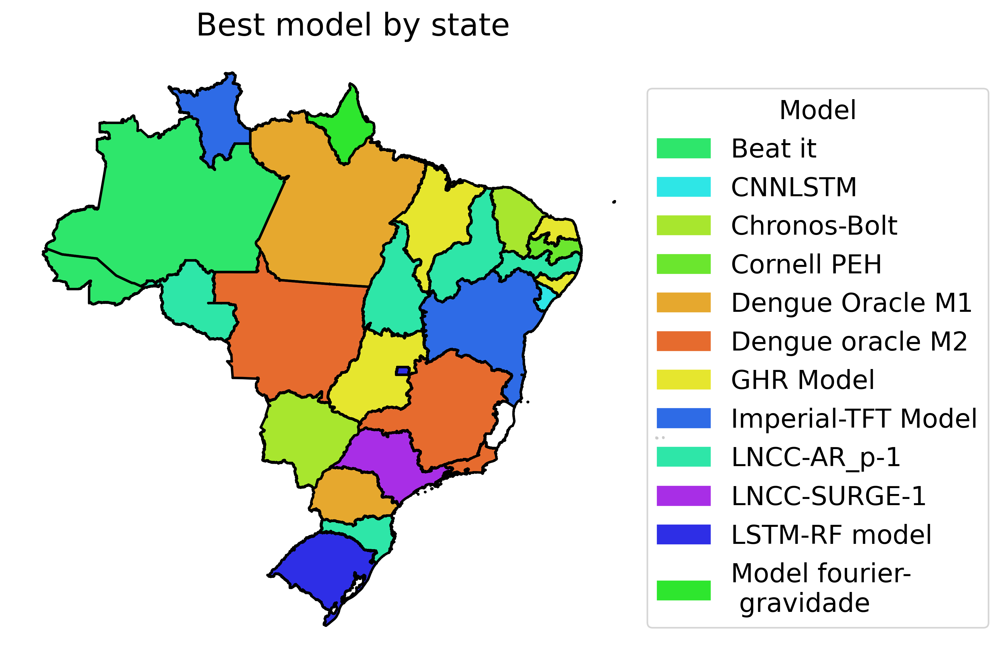

### Best-performing models per region

The rank for each region was computed using the equation below:

$$R_M = \sum_{i=1}^6 \frac{1}{R_{i,S}},$$

where the subscript $i$ refers to the score, the subscript $S$ to the state and the subscript $M$ to the region.

The table below presents the top five best-performing models in each region:

|Rank | North | Northeast | Midwest | Southeast | South |
|-----| ------| ----------| --------| ----------| ------|
|1    | 157   | 145       | 156     | 156       | 157   |
|2    | 156   | 135       | 155     | 108       | 137   |
|3    | 139   | 133       | 157     | 155       | 138   |
|4    | 150   | 150       | 135     | 135       | 155   |
|5    | 144   | 156       | 133     | 139       | 150   |

## WIS scores by region

The figures below present the WIS scores for each validation test and each state (x-axis) and model (y-axis). The models are ordered from the best regional model to the worst. The green rectangle highlights the lowest WIS score in each column.

### North

### Northeast

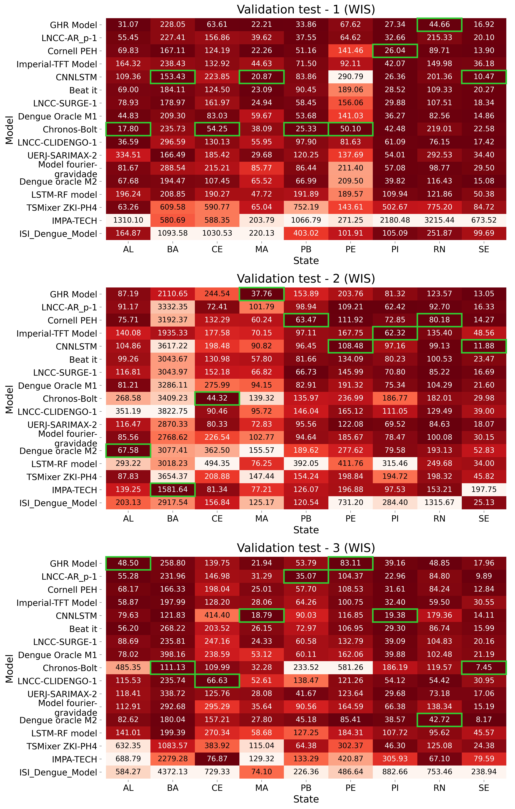

### Midwest

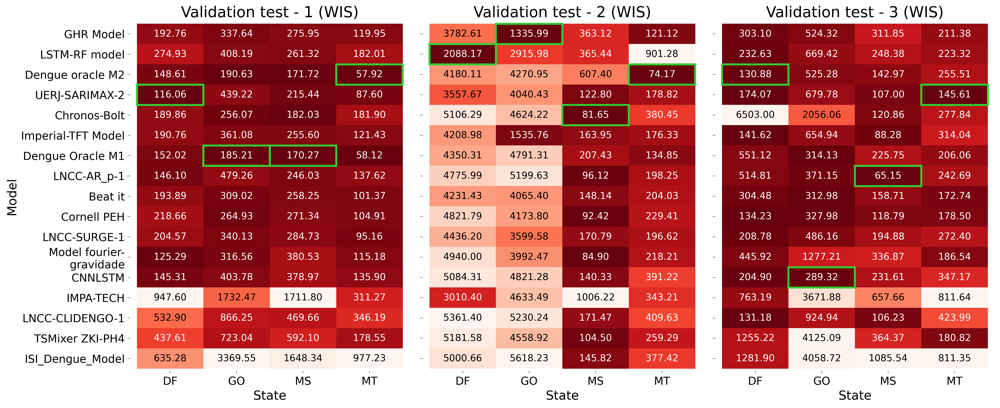

### Southeast

### South

## Predicted curves

The figures below show the curves of the submitted predictions by state. The model ID corresponding to each line is shown in the legend. The y-axis range is set to 1.5 times the maximum value of the observed data. Use the [Mosqlimate dashboard](https://api.mosqlimate.org/vis/dashboard/?dashboard=sprint
) to compare a subset of predictions and visualize their scores.

### North 

### Northeast 

### Midwest 

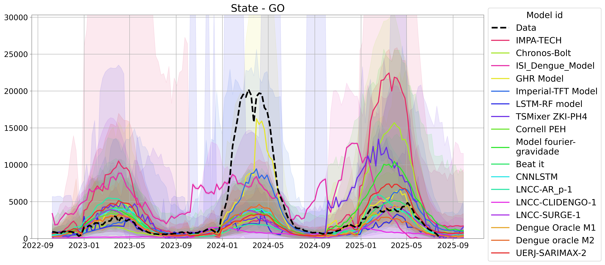

### Southeast 

### South

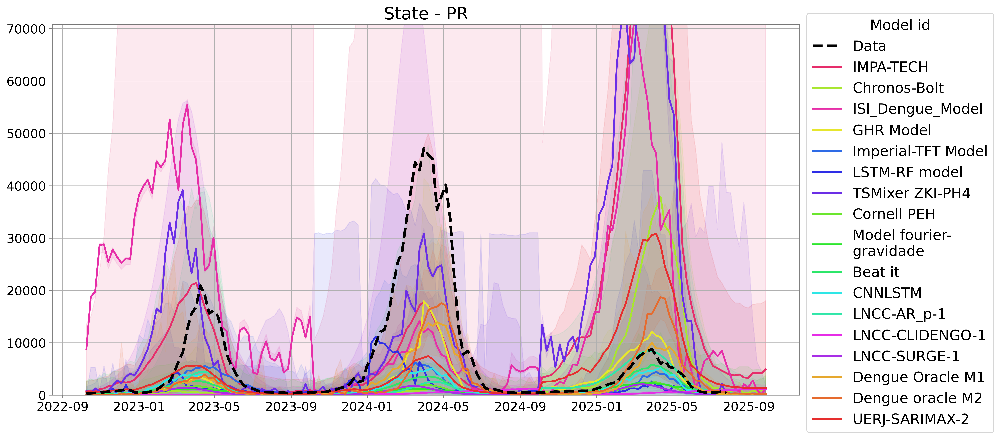

## Additional Analysis: Models' performance in predicting total cases 

To compute the total number of cases for each season based on the submitted predictions, we applied the following steps:  

1. **Weekly approximation**: For each predicted week in the season, we approximated the distribution as log-normal by fitting the submitted prediction intervals to the CDF of a log-normal distribution through an optimization procedure. When the median was zero, we fixed $\mu = 0.01$ and $\sigma = 0.5$.  

2. **Sampling**: Using the $\mu$ and $\sigma$ parameters obtained for each week, we generated 1,000 samples from the log-normal distribution of that week. These weekly samples were then summed across all weeks, resulting in a final array of 1,000 samples representing the total cases for the season.

3. **Prediction intervals**: From the summed values, we calculated the 50%, 80%, 90%, and 95% prediction intervals, along with the median, thus obtaining a probabilistic estimate of the total cases for the season. In addition, we plotted the 95% prediction interval and the median against the observed values for each season and state. 

4. **Evaluation**: Based on these probabilistic predictions, we compared the estimated total cases with the observed totals and computed the WIS.  

The steps were implemented across different notebooks:  
- Step 1: `log_normal_parameters_CDF.ipynb`  
- Steps 2–3: `compute_the_total_cases.ipynb`  
- Step 4: (WIS plots): `plot_scores.ipynb`  

###  Best-performing models per region

The best-performing models were identified by ranking each model according to their WIS in the total cases prediction task, following the same procedure as described in the previous sections. The table below shows the top five models for each region:

|Rank | North | Northeast | Midwest | Southeast | South |
|-----| ------| ----------| --------| ----------| ------|
|1    | 157   | 139       | 137     | 156       | 157   |
|2    | 150   | 145       | 135     | 108       | 137   |
|3    | 154   | 154       | 139     | 155       | 134   |
|4    | 143   | 152       | 144     | 143       | 156   |
|5    | 139   | 138       | 157     | 137       | 136   |

## WIS scores by region

The figures below present the WIS scores for each validation test and each state (x-axis) and model (y-axis) concerning the total number of cases in the season. The models are ordered from the best regional model to the worst. The green rectangle highlights the lowest WIS score in each column.

### North

### Northeast

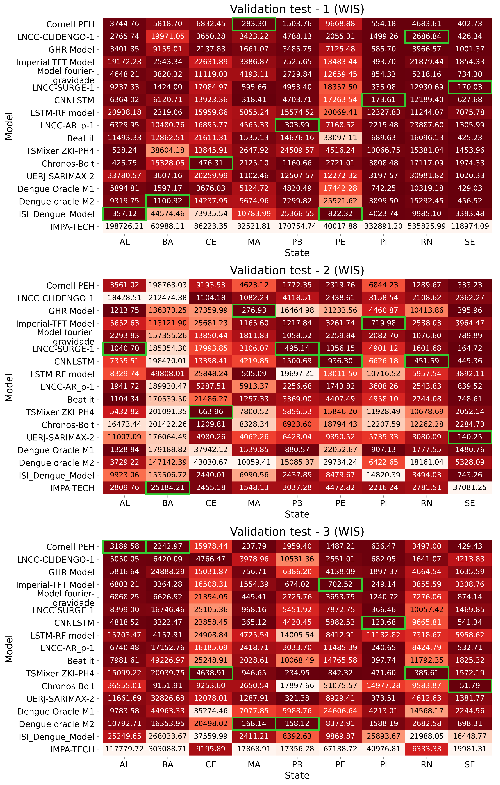

### Midwest

### Southeast

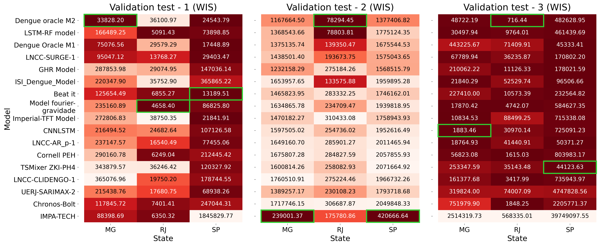

### South

### Plots

The figures below display the total number of cases predicted by each model using a parametric approximation to a log-normal distribution. The error bars represent the 95% prediction intervals. Red points and bars indicate models whose 95% prediction intervals did not capture the observed number of cases, while green points and bars indicate models whose intervals did include the observed values.

### North 

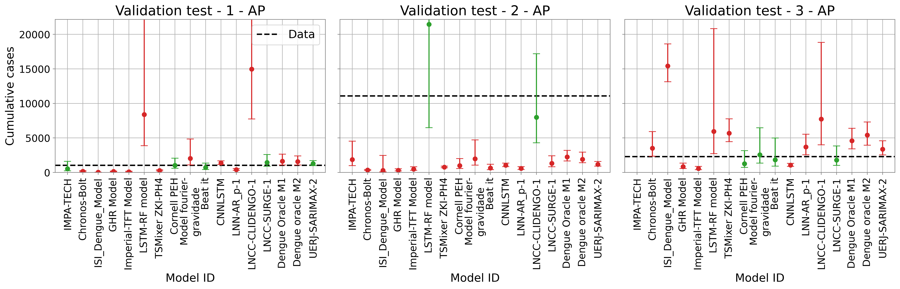

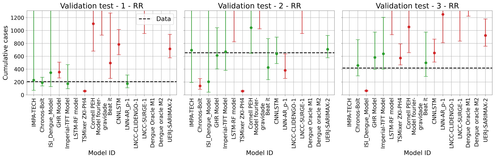

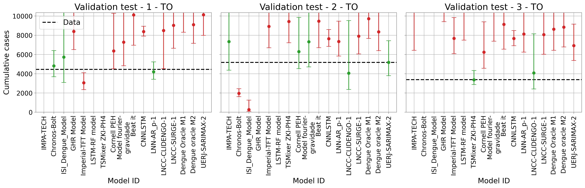

### Northeast 

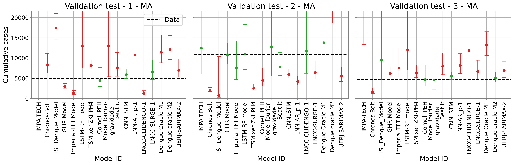

### Midwest 

### Southeast 

### South

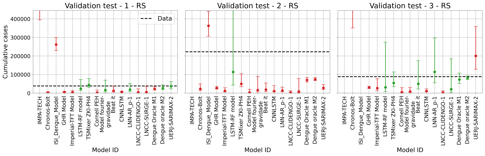

